# Ultimate Guide to Securely Deploying Django at Scale on AWS Elastic Container Service


## Overview
In this blog post, 

### tech stack
- PostgreSQL on AWS RDS
- 


### problems:
1. **Session**: When you want to scale a monolithic framework such as Django, you probably want to avoid hitting your database too much. Django defaults to [database as the session storage](https://docs.djangoproject.com/en/dev/topics/http/sessions/#configuring-sessions), but in this post we will be creating a AWS ElastiCache Redis instance to write/read our sessions.
2. **Static Files**: XKCD App will not require  

3. **Logs**:As this post is going to create many instances to serve the application, we


### Prerequisites

- Some Django knowledge
- Minimal Docker knowledge
- Free-tier AWS Account & Basic understanding of AWS
- [AWS CLI](https://aws.amazon.com/cli/) installed & AWS credentials set up


### Index

**Coding the XKCD Django App**
1. Creating and activating a virtual environment
2. Installing Django
3. Creating database models
4. Adding models to django admin page
5. Creating the homepage view
6. Adding homepage view to urls
7. Creating homepage.html
8. Creating requirements.txt file
9. Dockerizing our Django App
   9.1 testing the Docker Image

**Configuring AWS**
1. AWS RDS - Relational Database Service
   1.1. Configuring RDS Security Group
   1.2. Creating a Postgresql Database on RDS 
   1.3. Updating Django settings to use the PostgreSQL Database Backend
      1.3.1. Install the PostgreSQL library
      1.3.2. Update the settings.py
2. AWS Systems Manager Parameter Store
   1. Adding our secrets to Parameter Store
   2. Configuring Django App to use AWS Parameter Store
      1. Install AWS SDK for Python: boto3
      2. Update the settings.py file
   3. Migrating Django models to RDS instance
   4. Build & run the docker image with the aws credentials
   5. Creating Parameter Store IAM Role
   6. Creating a super user
3. ElastiCache Redis
   1. Creating the Security Group: XKCDAppElastiCacheSecurityGroup
   2. Creating the ElastiCache Redis Instance
   3. Adding ElastiCache endpoint to Parameter Store
   4. Installing [django-redis](https://github.com/jazzband/django-redis) package
   5. Updating Django settings to use Redis as Session Storage
4. Elastic Container Registry
   1. Uploading XKCD Apps Docker Image to ECR
5. Elastic Load Balancing
   1. ELB Security Group Creation
   2. ELB Creation
      1. Step 1: Configure Load Balancer
      2. Step 2: Security Settings
      3. Step 3: Security Groups
      4. Step 4: Routing: Target Group Creation
      5. Step 5: Registering Targets to Target Group
      6. Step 6: Review
      7. Step 7: Forward traffic from port 80 to port 8000
6. Elastic Container Service
   1. Creating an ECS Task Execution Role: XKCDAppECSTaskExecutionRole
   2. Creating ECS security group: XKCDAppECSSecurityGroup
   3. Creating Task Definition: XKCDAppTaskDefinition
      1 Adding a container to XKCDAppTaskDefinition
   4. Creating Cluster Service
      1. Step 1: Configure Service 
      2. Step 2: Configure Network 
      3. Step 3: Set Auto Scaling
      4. Step 4: Review
   5. Load Testing our App with Hey
   6. Creating auto scaling for XKCDAppClusterService
      1. Testing the Auto Scaling Policy
7. Updating security groups


### About AWS Security Groups & IAM Roles
On this blog post, whenever we are going to create an AWS Service we will be creating that service's Security Group or IAM Role beforehand.

All security groups will have fully open inbound/outbound rules at first, and when we are done with the application setup on AWS, we will go and revise the inbound/outbound rules of all security groups. 

## Coding the XKCD Django App

For this blog's demo, we can create a very small XKCD Comic Viewer Django application. It's going to only have a homepage view that will show a random comic using python module xkcd, and will have a button for another comic.

It will also update the view count of a XKCD comic in a database model with comic's id.

### 1. Creating and activating a virtual environment
```bash
# install the virtualenv package
pip install virtualenv

#create a virtualenv with the name venv
virtualenv venv

# activate virtualenv on windows
cd venv/Scripts
activate

# activate virtualenv on linux
./venv/bin/activate
```

### 2. Installing Django

```bash
# install django and xkcd python library
pip install django xkcd

# create a django project name xkcd_app
django-admin startproject xkcd_app

# you should get the following files created
xkcd_app
├── manage.py
└── xkcd_app
    ├── asgi.py
    ├── __init__.py
    ├── settings.py
    ├── urls.py
    └── wsgi.py
```


Let's review and change the `xkcd_app/settings.py`

```python
# /xkcd_app/xkcd_app/settings.py

# allow any host for now
ALLOWED_HOSTS = ['*']

# add our app to installed apps
INSTALLED_APPS = [
    .
    .
    'django.contrib.staticfiles',
    'xkcd_app'
]
```

### 3. Creating database models
Let's create our models. First we have to create a file named `models.py` on our `xkcd_app` folder.

```python
# /xkcd_app/xkcd_app/models.py
from django.db import models

class XKCDComicViews(models.Model):
    comic_number = models.IntegerField(primary_key=True, unique=True)
    view_count = models.IntegerField(default=0)
```

Let's migrate `XKCDComicViews` model to our database. Django will use sqlite3 by default for local development. 
```bash
# first apply default migrations
python manage.py migrate

# create our django apps migrations
python manage.py makemigrations xkcd_app

# and migrate them
python manage.py migrate xkcd_app
```

### 4. Adding models to django admin page

create a `admin.py` file under `xkcd_app/xkcd_app`

```python
#xkcd_app/xkcd_app/admin.py
from django.contrib import admin
from .models import XKCDComicViews

admin.site.register(XKCDComicViews)
```

### 5. Creating the homepage view
Let's create `views.py` under our xkcd_app.

```python
# /xkcd_app/xkcd_app/views.py
from django.shortcuts import render
from .models import XKCDComicViews
import xkcd

def get_comic_and_increase_view_count(comic_number, increase_by=1):
    # get or create this with given comic_number
    comic, _ = XKCDComicViews.objects.get_or_create(pk=comic_number)
    comic.view_count += increase_by # increase the view_count
    comic.save() # save it

def homepage(request):
    # get a random comic from xkcd lib.
    random_comic = xkcd.getRandomComic()
    # increase it's view count
    get_comic_and_increase_view_count(random_comic.number, increase_by=1)
    # create a context to render the html with.
    context = {
        "number": random_comic.number,
        "image_link": random_comic.getImageLink(),
        "title": random_comic.getTitle(),
        "alt_text": random_comic.getAltText()
    }
    # return rendered html.
    return render(request, 'xkcd_app/homepage.html', context)

```
### 6. Adding homepage view to urls
```python
# /xkcd_app/xkcd_app/urls.py
from django.contrib import admin
from django.urls import path
from .views import homepage
urlpatterns = [
    path('admin/', admin.site.urls),
    path('', homepage, name='homepage')
]
```
### 7. Creating homepage.html

```html
<!-- /xkcd_app/xkcd_app/templates/xkcd_app/homepage.html -->
<html>
<head>
<title>XKCD App</title>
<link rel="stylesheet" href="https://stackpath.bootstrapcdn.com/bootstrap/4.5.2/css/bootstrap.min.css" integrity="sha384-JcKb8q3iqJ61gNV9KGb8thSsNjpSL0n8PARn9HuZOnIxN0hoP+VmmDGMN5t9UJ0Z" crossorigin="anonymous">
</head>
<body>
  <div class="container">
    <div class="row" style="margin-top:15px">
        <div class="col-xs-8 col-sm-10 mx-auto col-md-12">
            <div class="col text-center">
                <h2 class="header" >#{{number}} | {{title}}</h2>
            <hr/>
            
            <hr/>
                <a class="btn btn-default" href="">Another One</a>
               <hr/>
               <a rel="license" href="http://creativecommons.org/licenses/by-nc/2.5/"></a>
               All credits for comics belongs to <a href="https://xkcd.com/license.html">XKCD.</a></p>
            </div>
        </div>
    </div>
<script src="https://stackpath.bootstrapcdn.com/bootstrap/4.5.2/js/bootstrap.min.js" integrity="sha384-B4gt1jrGC7Jh4AgTPSdUtOBvfO8shuf57BaghqFfPlYxofvL8/KUEfYiJOMMV+rV" crossorigin="anonymous"></script>
</body>
</html>
```

### 8. Creating requirements.txt file

Freeze the python requirements and move the file to root directory of the project. You are expected to regularly update your requirements.txt file.

```bash
# cd into the root directory of the project and then run the command below 

# be sure to activate the virtual env
pip freeze > requirements.txt
```
For this project the requirements.txt should look like this:
```txt
boto3
xkcd
django
psycopg2-binary
gunicorn
django-redis
```

### 9. Dockerizing our Django App

Create a `Dockerfile` on the root directory of the project.

```Dockerfile
# /Dockerfile
FROM python:3.8
# PYTHONUNBUFFERED variable is used for non-buffered stdout
ENV PYTHONUNBUFFERED=1
# update the packages
RUN apt update -y && apt upgrade -y 

# changing our working directory to be /usr/src
WORKDIR /usr/src/

# copying and installing python requirements
COPY requirements.txt requirements.txt
RUN pip install -r requirements.txt

# copying the whole django application
COPY xkcd_app/ .

# exposing our django port: 8000
EXPOSE 8000

# serving django with gunicorn on port 8000 (1 worker, timeout of 60 secs)
CMD ["gunicorn", "--bind", "0.0.0.0:8000", "--workers", "1", "--timeout", "60", "xkcd_app.wsgi"]
```

#### 9.1 testing the Docker Image

Let's build and run our docker image.

```bash
# build the image with the latest tag
docker build -t xkcd:latest .  

# run the image with port mapping 8000 to 8000
docker run -p 8000:8000 xkcd:latest

# output should look something like this.
# ... [1] [INFO] Starting gunicorn 20.1.0
# ... [1] [INFO] Listening at: http://0.0.0.0:8000 (1)
# ... [1] [INFO] Using worker: sync
# ... [8] [INFO] Booting worker with pid: 8
```
If everything goes well, you can go to [http://0.0.0.0:8000](http://0.0.0.0:8000) or [http://localhost:8000](http://localhost:8000) to see XKCD app working.

----------

## Configuring AWS

### 1. AWS RDS - Relational Database Service
#### 1.1 Configuring RDS Security Group
On AWS Console, go to `Security Groups` under the `VPC` service. Press Create Security Group button.

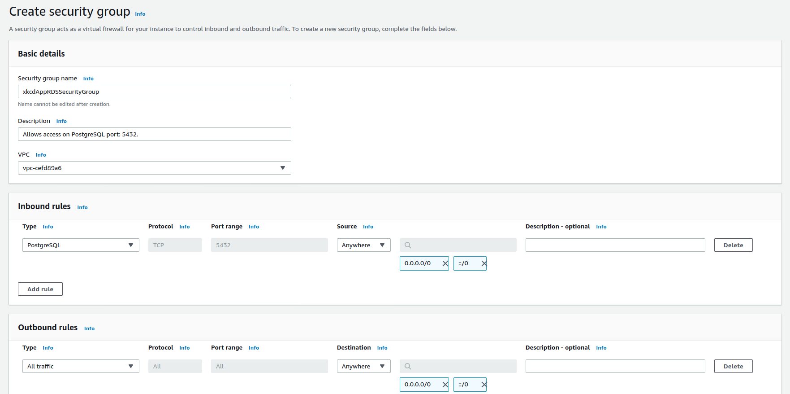
| Setting | Option |
|-- |-- |
| Name | xkcdAppRDSSecurityGroup |
| Description | Allows access on PostgreSQL port: 5432. |
| VPC | Select your VPC, or use the default one. |
| Inbound Rules | Type: `PostgreSQL`, Source: `Anywhere` |
| Outbound Rules | Type: `All Trafic`, Destination: `Anywhere` |


#### 1.2 Creating a Postgresql Database on RDS 
On AWS Console, go to `RDS` and start to create a new RDS instance. RDS creation settings below uses default VPC and Free-tier. Feel free to change the configuration according to your requirements.
<details open>
  <summary> <b> Table of Configuration </b></summary>

|Setting  | Option | Detail |
| -- | -- | -- | 
| Creation Method | Standart create | |
| Engine Option | PostgreSQL | |
| Engine Version | 12.5-R1 | Specify your DB engine version. |
| Templates | Free Tier | If you are building for prod or test envs, choose respectively.|
| DB Instance Identifier | xkcdappdb | |
| Master Username | postgres | |
| Master Password | < redacted > | |
| DB Instance Class | db.t2.micro | you can upgrade the instance class to your needs. |
| Storage Type| General Purpose(SSD) | |
| Allocated Storage | 20GB | |
| Enable Storage Autoscaling | False | You can enable this if you need it. |
| Multi-AZ Deployment | False | This feature not included in the free-tier. Production environments would benefit from this feature. |
| VPC | Default VPC | Ideally you should create your own VPC and choose that. |
| Subnet Group | default | |
| Public Access | Yes | We will turn this feature off later. We need public access only in the first setup to test things. |
| VPC Security Group |Delete default and choose existing: `xkcdAppRDSSecurityGroup` | |
| Availability Zone | eu-west-2a | Choose one AZ if you are on free-tier.|
| Database Authentication | Password Authentication | |
| Initial Database Name | xkcd_test_db | **Initial Database Name** field has to be filled or the AWS will not create a database inside the RDS instance. If you fail to fill this field, you will have to manually create the database.|

</details>


<details>
  <summary> <b> Database Engine </b></summary>

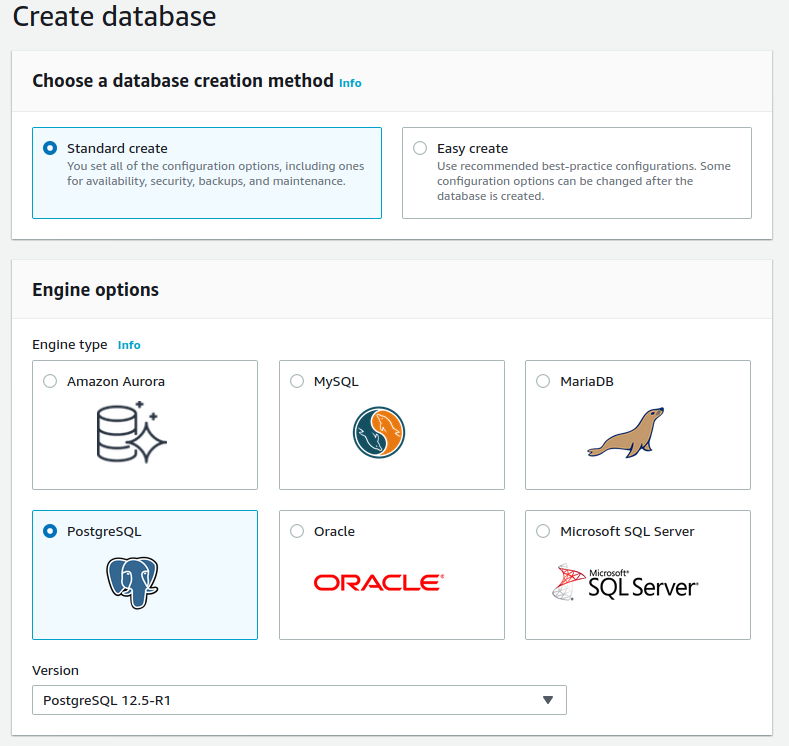

</details>
<details>
  <summary> <b> RDS Creation Template </b></summary>

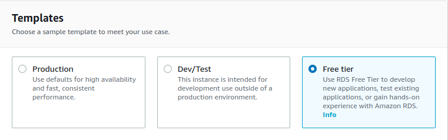

</details>
<details>
  <summary> <b> Database Settings and Credentials </b></summary>

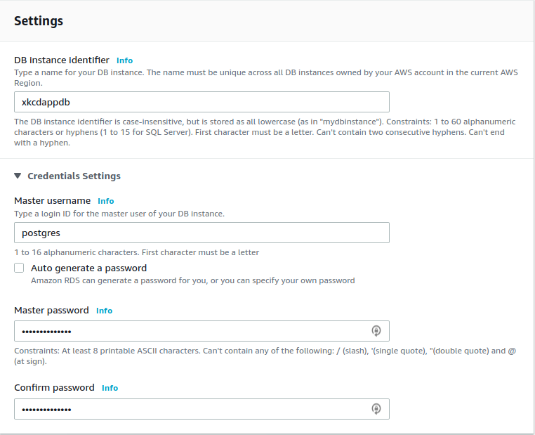

</details>

<details>
  <summary><b> Database Instance Class  </b></summary>

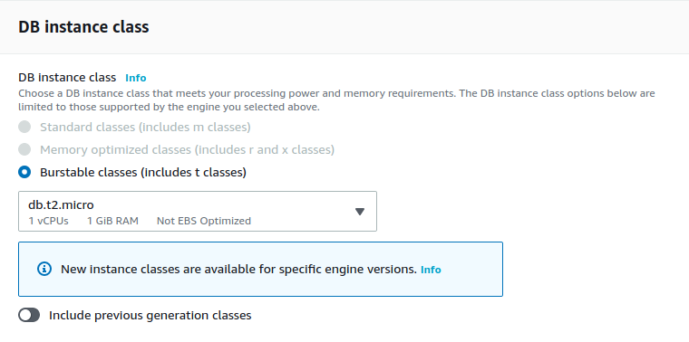

</details>
<details>
  <summary><b> Database Storage </b></summary>

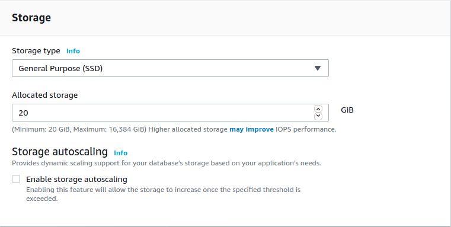

</details>
<details>
  <summary><b> Connectivity  </b></summary>

Be sure to select Public Access: Yes. We will need to access the database publicly in the first setup, but we will turn it off later.
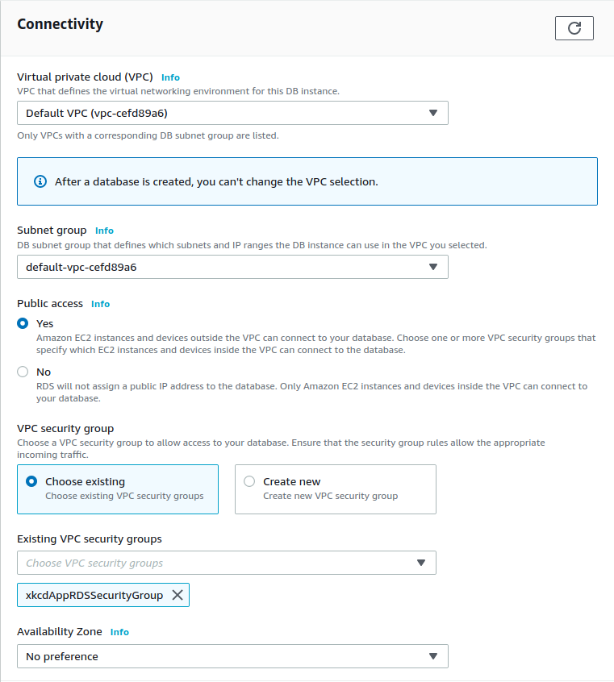

</details>
<details>
  <summary><b>  Database Authentication </b></summary>

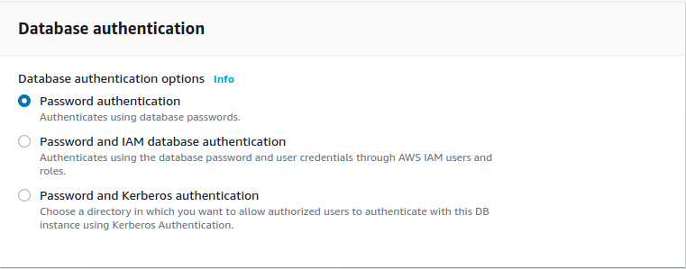

</details>
<details open>
  <summary><b> Additional Configuration  </b></summary>


</br>

> **_NOTE:_**  **Additional Configuration: Initial Database Name** field has to be filled or the AWS will not create a database inside the RDS instance you are creating. If you fail to fill this field, you will have to manually create the database.


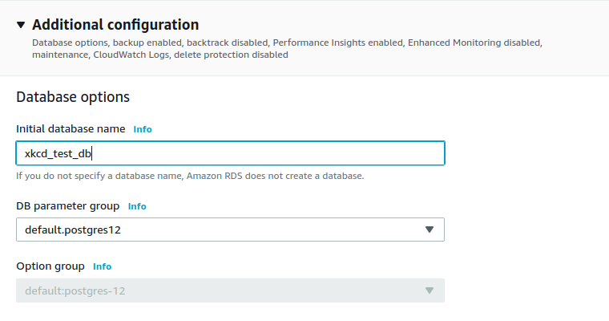

</details>

</details>
<details>
  <summary><b>  Acquiring the Database Connection Endpoint </b></summary>

Wait for the database creation to be complete. Go to `xkcdappdb` on `RDS > Databases` and then go to `Connectivity & Security` tab. 

</details>

#### 1.3 Updating Django settings to use the PostgreSQL Database Backend

##### 1.3.1 Install the PostgreSQL library
```bash
# be sure to activate the venv environment
pip install psycopg2-binary
```


##### 1.3.2 Update the settings.py
```python
#/xkcd_app/xkcd_app/settings.py
import os

DATABASES = {
    'default': {
        'ENGINE': 'django.db.backends.postgresql',
        'NAME': os.environ.get('DATABASE_NAME'),
        'USER': os.environ.get('DATABASE_USER'),
        'PASSWORD': os.environ.get('DATABASE_PASSWORD'),
        'HOST': os.environ.get('DATABASE_HOST'),
        'PORT': '5432'
    }
}

```

Using environment variables for application configuration **is not a secure way** of doing things. Integrating AWS Parameter Store to our `settings.py` file is something easy. Let's configure AWS Systems Manager Parameter Store for XKCD App.

### 2. AWS Systems Manager Parameter Store

Go to `Parameter Store` under `AWS Systems Manager` and click on **Create Parameter**.

Parameter Store lets you create categorized paramater names, so you can have different parameters for different apps or app environments.
#### 2.1 Adding our secrets to Parameter Store
For **DATABASE_NAME** parameter, you can create a parameter as following:

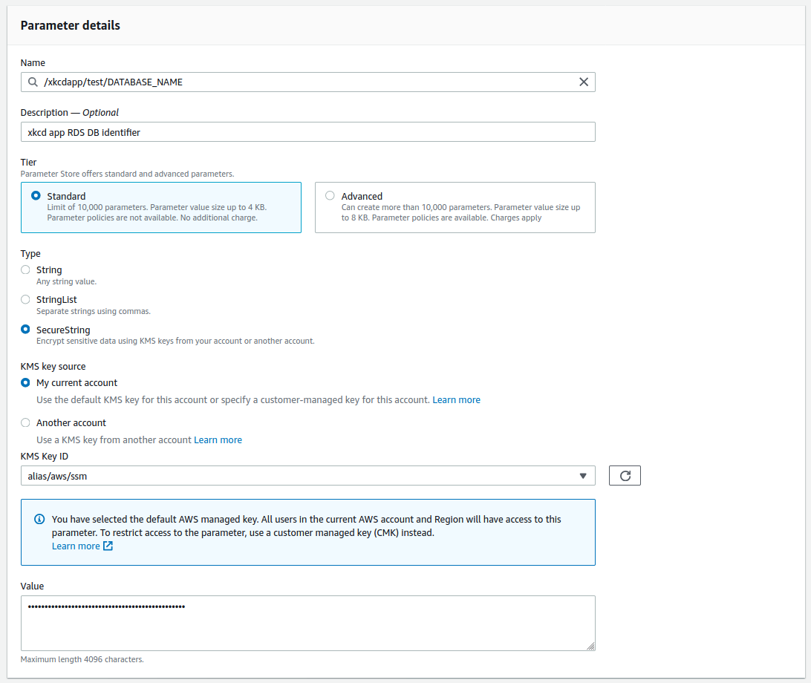
| Setting | Option | Detail |
| --| --| --|
| Name | xkcdapp/test/DATABASE_NAME | app and environment categorized parameter name |
| Description | xkcd app RDS test DB identifier | |
| Tier | Standard | |
| Type | SecureString | This type of parameters are going to be encrypted while sitting. |
| KMS key source | My Current Account |  |
| KMS Key ID | alias/aws/ssm | Choose the default AWS managed key. This will allow ECS containers to access to parameters without further configuration. |
| Value | xkcddb_test_db  | Type the database name you gave in the RDS Creation: Additional Configuration step. |

Follow the same steps to add the remaining database connection credentials to paramater store. You may also want to add `SECRET_KEY` variable generated for your Django project. Django's `SECRET_KEY` is used for encryption jobs inside Django. 

When you are finished with adding the secrets, you should see something like this on Parameter Store Console.

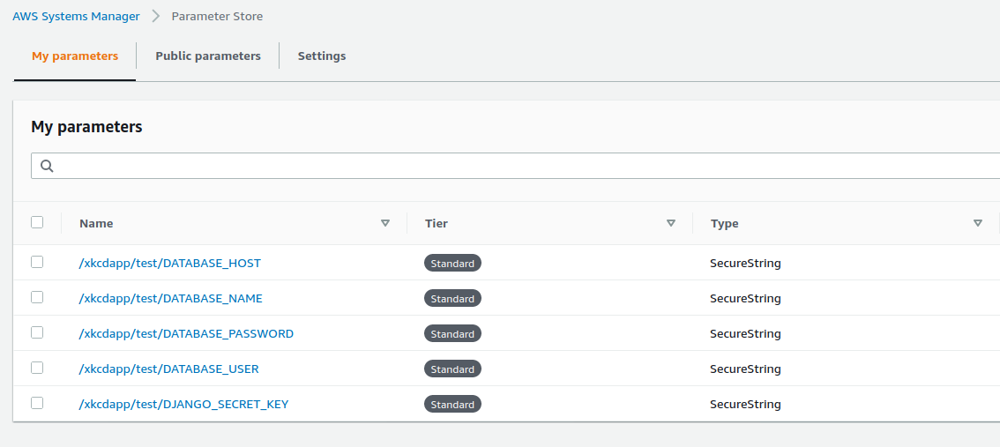

You can check the existence of parameters with AWS CLI, if you have it set up.
```bash
aws ssm get-parameters --name "/xkcdapp/test/DATABASE_HOST" --with-decryption --region <your_region> --profile <your_aws_cli_profile>
```

#### 2.2 Configuring Django App to use AWS Parameter Store

##### 2.2.1 Install AWS SDK for Python: boto3
```bash
# be sure to be in the venv virtual environment
pip install boto3
```
##### 2.2.2 Update the settings.py file

```python
# xkcd_app/xkcd_app/settings.py
import boto3
ssm = boto3.client('ssm', region_name='eu-west-2')

prefix = 'xkcdapp'
env = 'test'
prefixenv = f"/{prefix}/{env}/"

SECRET_KEY = ssm.get_parameter(Name=prefixenv + "DJANGO_SECRET_KEY", WithDecryption=True)['Parameter']['Value'] 

DATABASES = {
    'default': {
        'ENGINE': 'django.db.backends.postgresql',
        'NAME': ssm.get_parameter(Name=prefixenv + "DATABASE_NAME", WithDecryption=True)['Parameter']['Value'],
        'USER': ssm.get_parameter(Name=prefixenv + "DATABASE_USER", WithDecryption=True)['Parameter']['Value'],
        'PASSWORD': ssm.get_parameter(Name=prefixenv + "DATABASE_PASSWORD", WithDecryption=True)['Parameter']['Value'],
        'HOST': ssm.get_parameter(Name=prefixenv + "DATABASE_HOST", WithDecryption=True)['Parameter']['Value'],
        'PORT': '5432'
    }
}
```

#### 2.3 Migrating Django models to RDS instance

> **_NOTE:_** : Be sure that your AWS Accounts credentials are set in the AWS CLI's `credentials` file.

Migrate our migrations to AWS RDS.
```bash
python manage.py migrate

# Operations to perform:
#   Apply all migrations: admin, auth, contenttypes, sessions, xkcd_app
# Running migrations:
#   Applying contenttypes.0001_initial... OK
#   Applying auth.0001_initial... OK
#   .
#   .
#   Applying sessions.0001_initial... OK
#   Applying xkcd_app.0001_initial... OK
```


#### 2.4 Build & run the docker image with the aws credentials
If you want to build and test the docker image with the application secrets on the AWS Parameter Store:
1. build the image again to apply the `settings.py` file changes to docker image.
2. run the image with `AWS_ACCESS_KEY_ID`, `AWS_SECRET_ACCESS_KEY` environment variables set. 
```bash
# build the image again
docker build -t xkcd:latest .  

# run with AWS credentials set in the environment variables.
docker run -p 8000:8000 -e AWS_ACCESS_KEY_ID='XXXXXXXXXXXX' -e AWS_SECRET_ACCESS_KEY='YYYYYYYYYYY' xkcd:latest
```

We won't need to send the AWS Credentials to our Docker image when we deploy on the Elastic Container Service, as the AWS automatically sets those environment variables upon instance creation.


#### 2.5 Creating Parameter Store IAM Role
Go to `Roles` under `AWS IAM` and  click on **Create Role**.

Select the _System Manager_ use case.

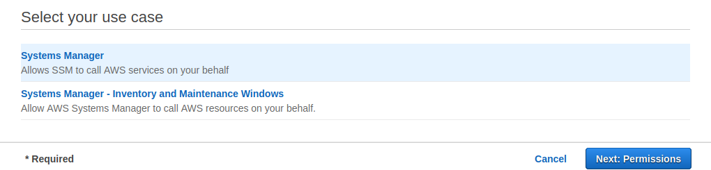

Click on _Next: Permissions_ and then `Create Policy`.

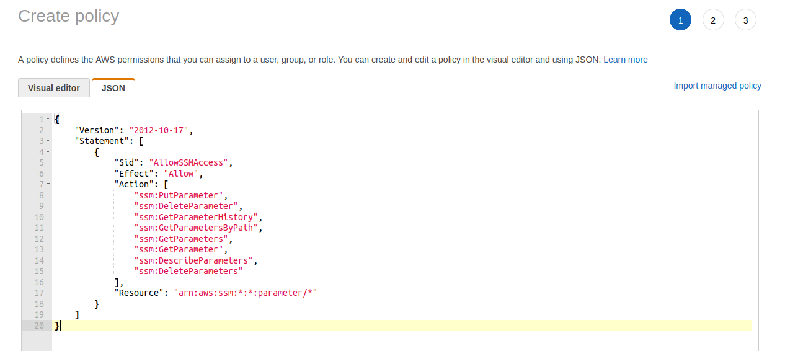

Copy and paste the following AWS IAM Policy to editor and hit next.

```json
{
    "Version": "2012-10-17",
    "Statement": [
        {
            "Sid": "AllowSSMAccess",
            "Effect": "Allow",
            "Action": [
                "ssm:PutParameter",
                "ssm:DeleteParameter",
                "ssm:GetParameterHistory",
                "ssm:GetParametersByPath",
                "ssm:GetParameters",
                "ssm:GetParameter",
                "ssm:DescribeParameters",
                "ssm:DeleteParameters"
            ],
            "Resource": "arn:aws:ssm:*:*:parameter/*"
        }
    ]
}
```

Give a name and description to Parameter Store access role.

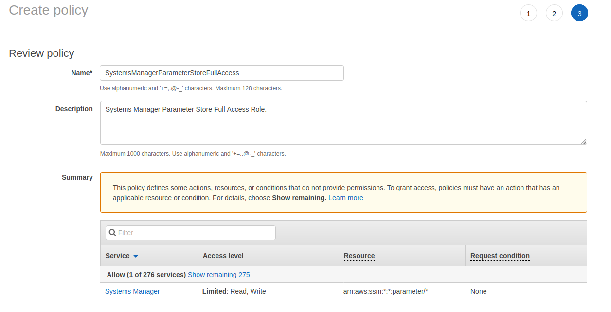

|Setting  |Option | 
| -- | -- | 
| Name | SystemsManagerParameterStoreFullAccess | 
| Description | Systems Manager Parameter Store Full Access Role. | 

We will be attaching this IAM Role to ECS containers we are going to run to allow them to read the parameters.


#### 2.6 Creating a super user

When you are connected to your RDS instance, you can create an admin user with the following command. 

```bash
python3 manage.py createsuperuser
```


### 3. ElastiCache Redis

#### 3.1 Creating the Security Group: XKCDAppElastiCacheSecurityGroup

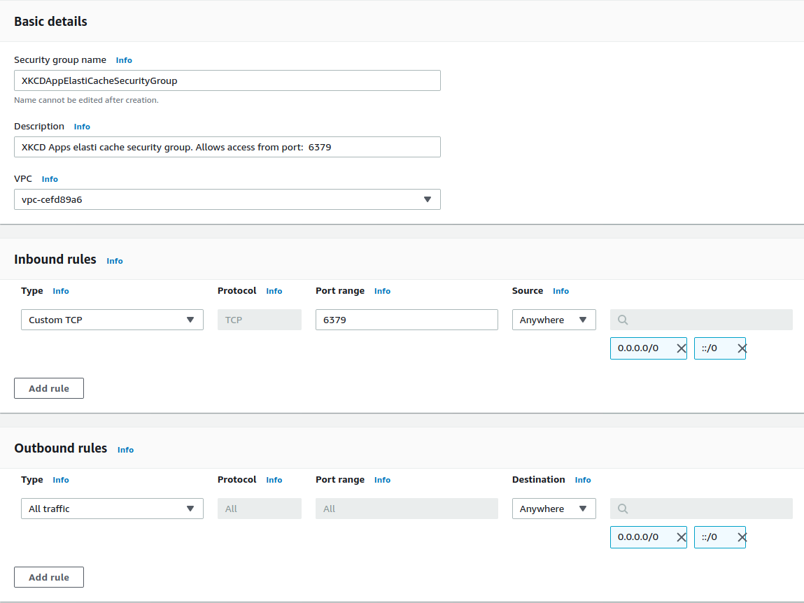

| Setting | Option |
|-- |-- |
| Name | XKCDAppElastiCacheSecurityGroup |
| Description | XKCD Apps elasti cache security group. Allows access from port:  6379 |
| VPC | Select your VPC, or use the default one. |
| Inbound Rules | Type: `CustomTCP`, Port Range: `6379`, Source: `Anywhere` |
| Outbound Rules | Type: `All Trafic`, Destination: `Anywhere` |

#### 3.2 Creating the ElastiCache Redis Instance
Go to `Redis` under `ElastiCache` and press create button.


<details open>
  <summary><b> Table of Configuration </b></summary>

| Setting | Option |
| --| --|
| Cluster Engine | Redis, Cluster Mode Disabled | 
| Location | Amazon Cloud |
| Name | xkcdappredis |
| Description| Session storage for XKCD App |
|Engine version compatibility | 6.x |
| Port| **6379**|
| Parameter group| default.redis6.x|
| Node type| **cache.t2.micro (0.5 GiB)** |
| Number of replicas| 0 |
| Multi-AZ | False |
| Subnet Group| Create new|
| Subnet Group Name| ecachesubnetgroup |
| Subnet Group Description | Subnet group for XKCD apps ElastiCache Redis Storage.|
| Subnet Group VPC ID | Default VPC ID | 
| Subnet Group Subnets | 2c, 2a, 2b  |
| Subnet Group AZ Placement | No preference|
| Security Group | XKCDAppElastiCacheSecurityGroup |
| Encryption-at-Rest | True |
| Encryption Key | Default |
| Encryption in transit | True | 
| Access Control Option | No Access |
</details>
<details>
  <summary><b> Engine and Location  </b></summary>

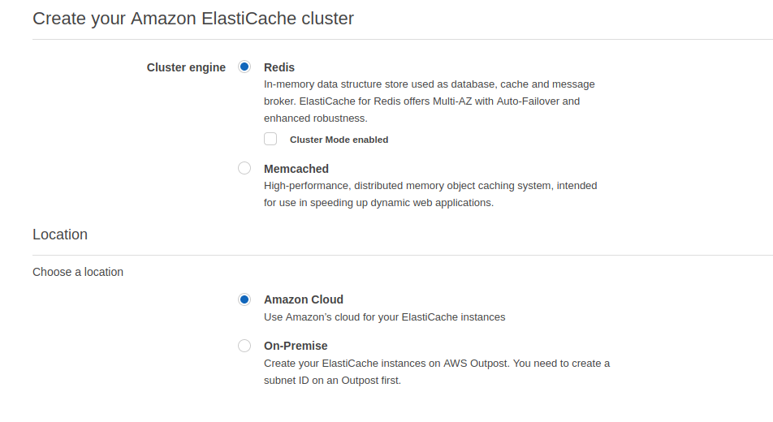
</details>
<details>
  <summary><b> Redis Settings  </b></summary>

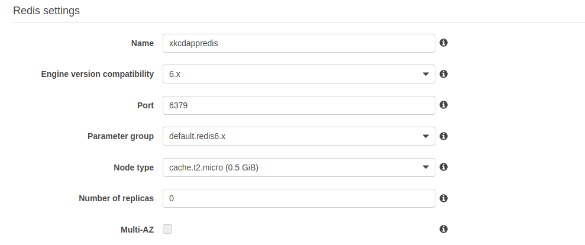

</details>
<details>
  <summary><b> Advanced Redis Settings </b></summary>

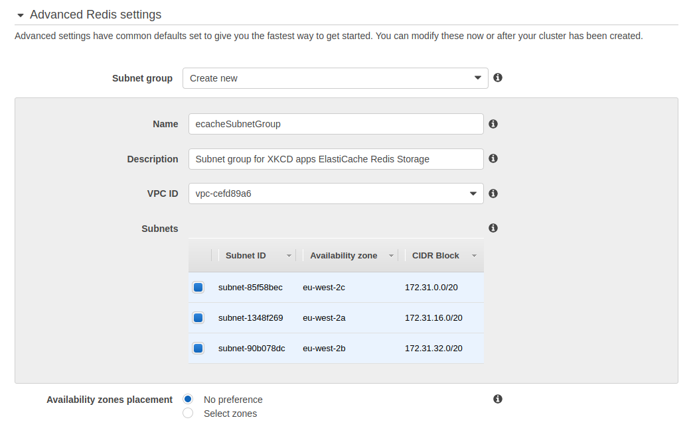

</details>
<details>
  <summary><b> Security  </b></summary>

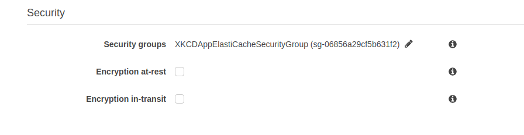
</details>


#### 3.3 Adding ElastiCache endpoint to Parameter Store
Go to `Parameter Store` under `AWS Systems Manager` and add `ELASTICACHE_ENDPOINT` **without port** `:6379` to parameter store.


| Setting | Option | 
| --| --|
| Name | xkcdapp/test/ELASTICACHE_ENDPOINT | 
| Description | xkcd app ElastiCache Redis Endpoint | 
| Tier | Standard |
| Type | SecureString |
| KMS key source | My Current Account |
| KMS Key ID | alias/aws/ssm |
| Value | xkcdappredis.xxxxx.yyyy.rrrr.cache.amazonaws.com  | 


#### 3.4 Installing [django-redis](https://github.com/jazzband/django-redis) package
```bash
# be sure to be in venv virtuall environment
pip install django-redis
```
#### 3.5 Updating Django settings to use Redis as Session Storage

```python
# xkcd_app/xkcd_app/settings.py
# ELASTICACHE_ENDPOINT without the port 
ELASTICACHE_ENDPOINT = ssm.get_parameter(Name=prefixenv + "ELASTICACHE_ENDPOINT", WithDecryption=True)['Parameter']['Value']
CACHE_LOCATION =  f"redis://{ELASTICACHE_ENDPOINT}/0"
CACHES = {
    "default": {
        "BACKEND": "django_redis.cache.RedisCache",
        "LOCATION": CACHE_LOCATION,
        "OPTIONS": {
            "CLIENT_CLASS": "django_redis.client.DefaultClient",
        }
    }
}
#Use the redis as Session storage as well.
SESSION_ENGINE = "django.contrib.sessions.backends.cache"
SESSION_CACHE_ALIAS = "default"
```

### 4. Elastic Container Registry
Go to `Repositories` under `Elastic Container Registry` and click on the Create Repository button. Give your ECR repository a name and click create.

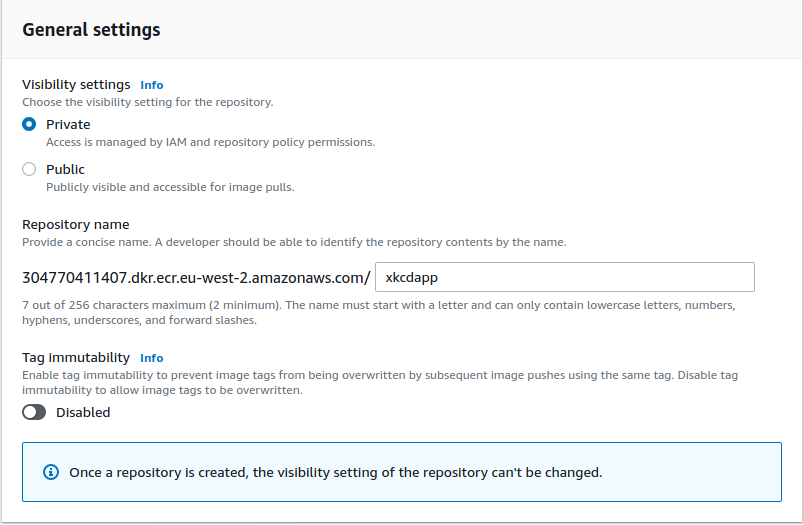

#### 4.1 Uploading XKCD Apps Docker Image to ECR
Go to detail page of your repository and click on the `View Push Commands` on the upper right. This will give you `login`, `build`, `tag` and `push` commands specific to your repository.

```bash
# get credentials to ECR Repo
aws ecr get-login-password --region eu-west-2 | docker login --username AWS --password-stdin 12345678912.dkr.ecr.eu-west-2.amazonaws.com

#build your image
docker build -t xckdapp .

# tag it as the latest
docker tag xckdapp:latest 12345678912.dkr.ecr.eu-west-2.amazonaws.com/xckdapp:latest

# push to ECR
docker push 12345678912.dkr.ecr.eu-west-2.amazonaws.com/xckdapp:latest

```

### 5. Elastic Load Balancing
We are going to access to our Elastic Container Service container instances through a AWS Elastic Load Balancer. We are going to create the ELB first in order to add it to Elastic Container Service upon creation.

#### 5.1 ELB Security Group Creation
Go to `Security Groups` under `VPC` and create one.

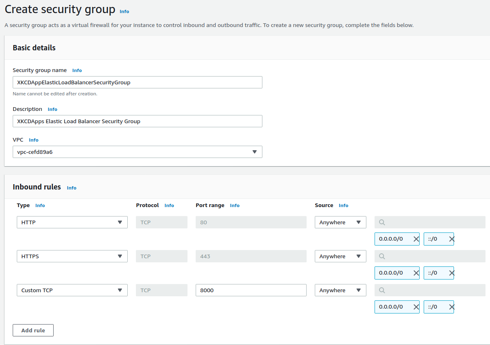


| Setting | Option |
|-- |-- |
| Name | XKCDAppElasticLoadBalancerSecurityGroup |
| Description | XKCDApps Elastic Load Balancer Security Group. 
| VPC | Select your VPC, or use the default one. |
| Inbound Rules | Type: `HTTP`, Source: `Anywhere` |
| Inbound Rules | Type: `HTTPS` Source: `Anywhere` |
| Inbound Rules | Type: `CustomTCP`, Port Range: `8000`, Source: `Anywhere` |
| Outbound Rules | Type: `All Trafic`, Destination: `Anywhere` |


#### 5.2 ELB Creation

Go to `Load Balancers` under `EC2` and click on Create Load Balancer button and select `Application Load Balancer`.

##### 5.2.1 - Step 1: Configure Load Balancer
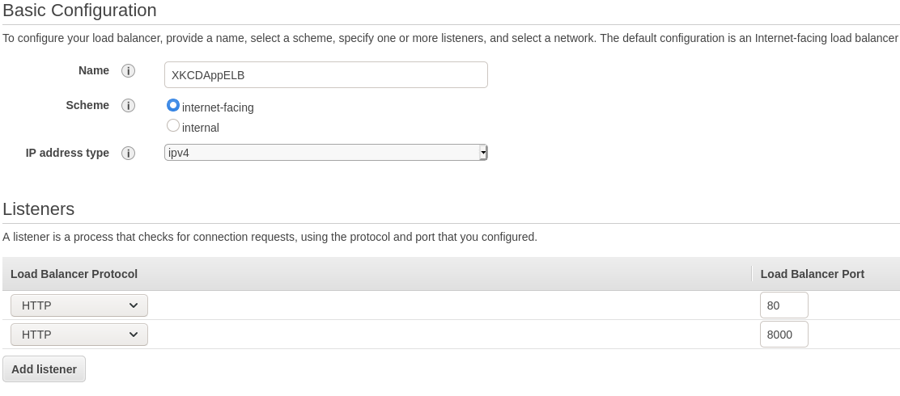


For Availability Zones, you should remember you AZ choices, as you will need to use same configuration for Elastic Container Service creation.

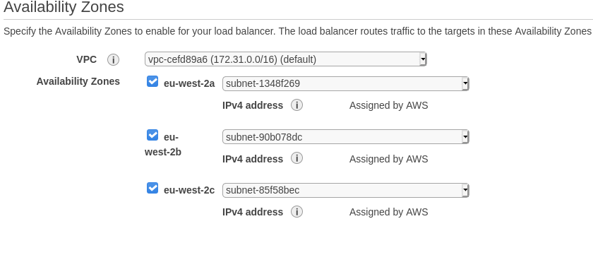

| Setting | Option |
|-- |-- |
| Load Balancer Type | Application Load Balancer |
| Name |  XKCDAppELB |
| Scheme  | internet-facing  |
| IP address type | ipv4 |
| Listeners | HTTP: 80  |
| Listeners | HTTP: 8000 |
| Availability Zones | 2a, 2b, 2c |

##### 5.2.2 - Step 2: Security Settings
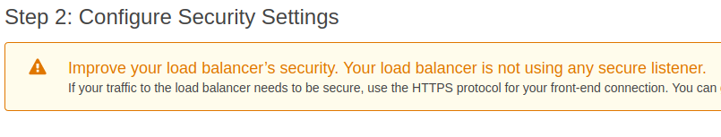

We are not going to use HTTPS for this demo, feel free to skip this step.

##### 5.2.3 - Step 3: Security Groups

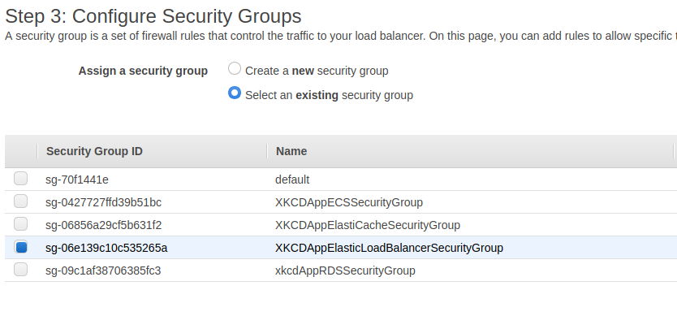

##### 5.2.4 - Step 4: Routing: Target Group Creation

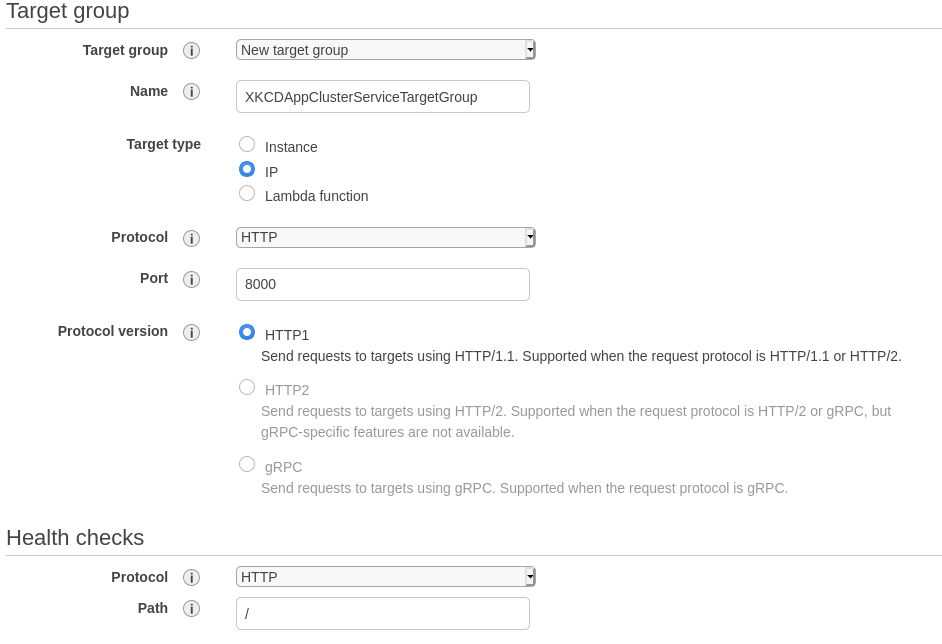

| Setting | Option |
|-- |-- |
| Target Group | New target group |
| Name |  XKCDAppClusterServiceTargetGroup |
| Target Type  | IP  |
| Protocol | HTTP |
| Port | 8000  |
| Protocol version | HTTP1 |
| Health Checks: Protocol | HTTP  |
| Health Checks: Path | / |

##### 5.2.5 - Step 5: Registering Targets to Target Group

Feel free to skip this step, ECS will going to manage target groups.

##### 5.2.6 - Step 6: Review
Click on create button. And when you go back to Load Balancers console, you should see something like this. 

| Name| DNS name | state |
| --|-- |-- |
|XKCDAppELB| XKCDAppELB-123456789.eu-west-2.elb.amazonaws.com| provisioning|

We will be using the DNS name to connect to our ECS instances, take a note of it.

##### 5.2.7 -  Step 7: Forward traffic from port 80 to port 8000

Go to `Listeners` tab on XKCDAppELB's detail view under `Load balancers`. On listener `HTTP: 80` click on `view/edit rules`.

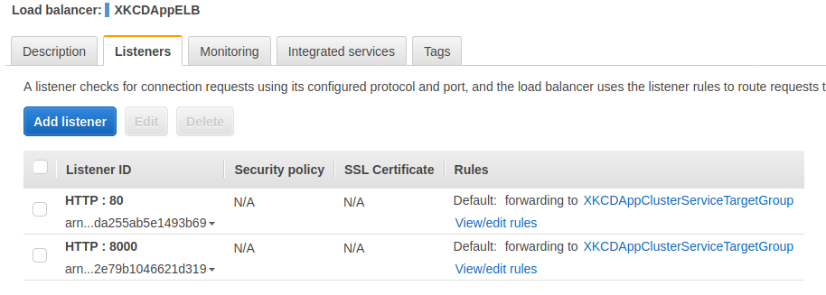

Add a rule to forward HTTP:80 traffic to HTTP:8000.

| Setting | Option | 
| --|-- | 
| Path | * | 
| Redirect to  | HTTP 8000| 
| HTTP Code| 301 - Permanently Moved | 


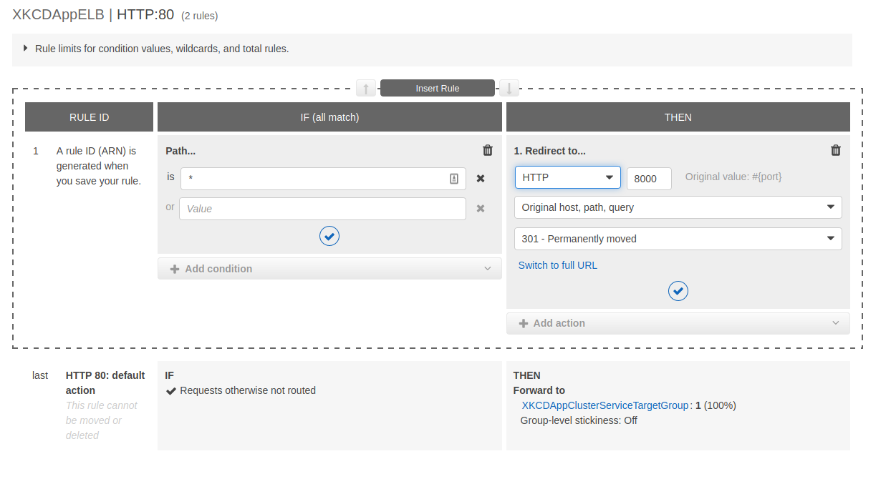

 
### 6. Elastic Container Service
#### 6.1 Creating an ECS Task Execution Role: XKCDAppECSTaskExecutionRole

Go to `Role` under `IAM` and click on create Role button. Attach policies below:
1. AmazonECSTaskExecutionRolePolicy (aws managed)
2. SystemManagerParameterStoreFullAccess (custom)

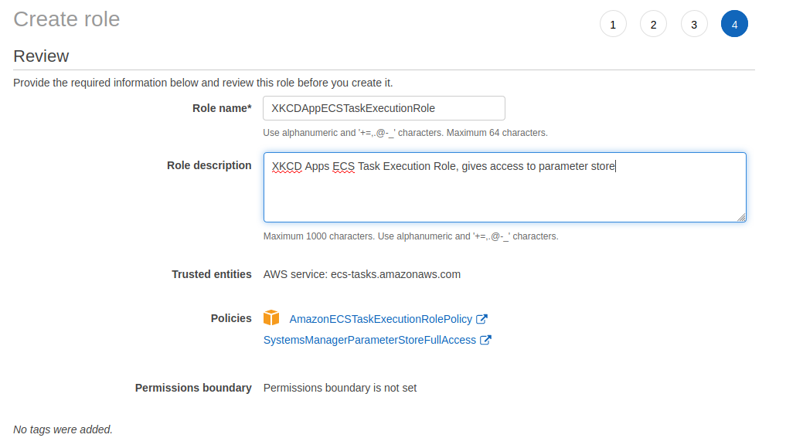

#### 6.2 Creating ECS security group: XKCDAppECSSecurityGroup

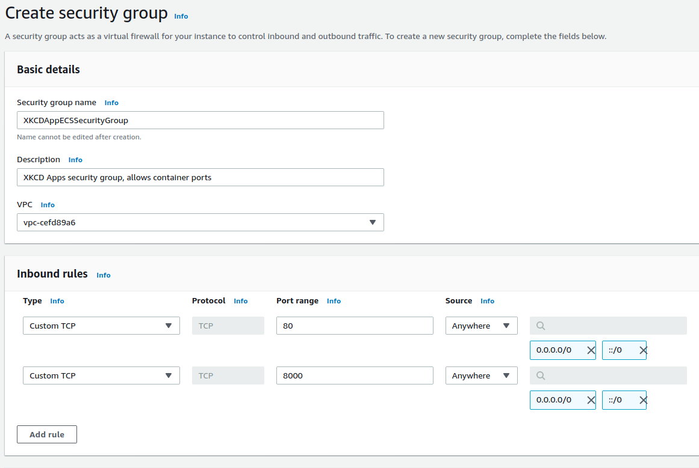

| Setting | Option |
|-- |-- |
| Name | XKCDAppECSSecurityGroup |
| Description | XKCD Apps security group, allows container ports |
| VPC | Select your VPC, or use the default one. |
| Inbound Rules | Type: `CustomTCP`, Port Range: `80`, Source: `Anywhere` |
| Inbound Rules | Type: `CustomTCP`, Port Range: `8000`, Source: `Anywhere` |
| Outbound Rules | Type: `All Trafic`, Destination: `Anywhere` |


#### 6.3 Creating Task Definition: XKCDAppTaskDefinition
Go to `Task Definitions` under `Elastic Container Service` and create task definition.

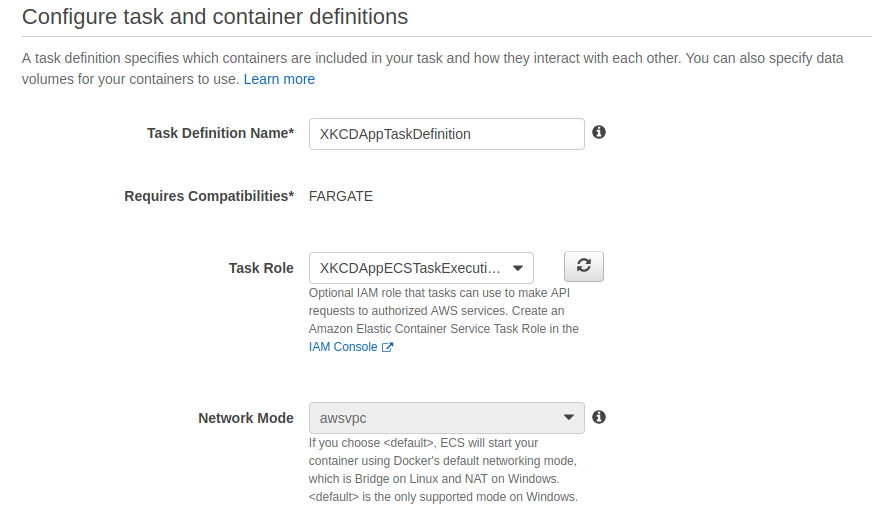
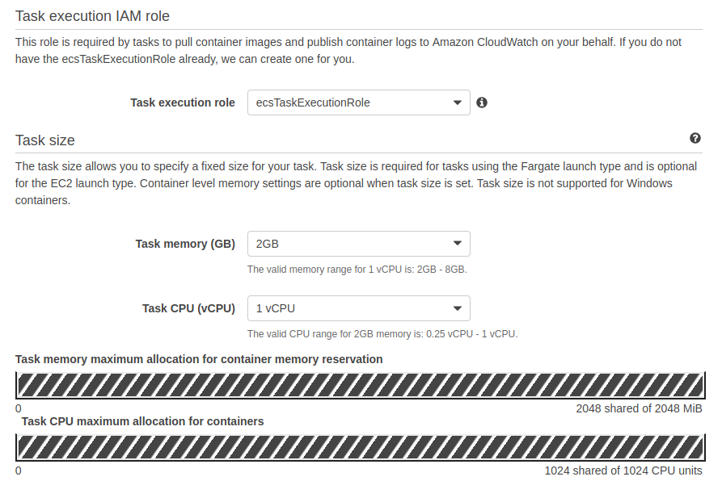

| Setting | Option |
| -- | -- |
| Launch Type | Fargate |
| Name | XKCDAppTaskDefinition |
|  Task Role | XKCDAppECSTaskExecutionRole |
|  Network mode |awsvpc  |
| Task Execution Role | ecsTaskExecutionRole |
| Task Memory | 2 GiB |
| Task CPU | 1vCPU  |

##### 6.3.1 Adding a container to XKCDAppTaskDefinition

Click on `Add container` button under the section `Container Definitions`

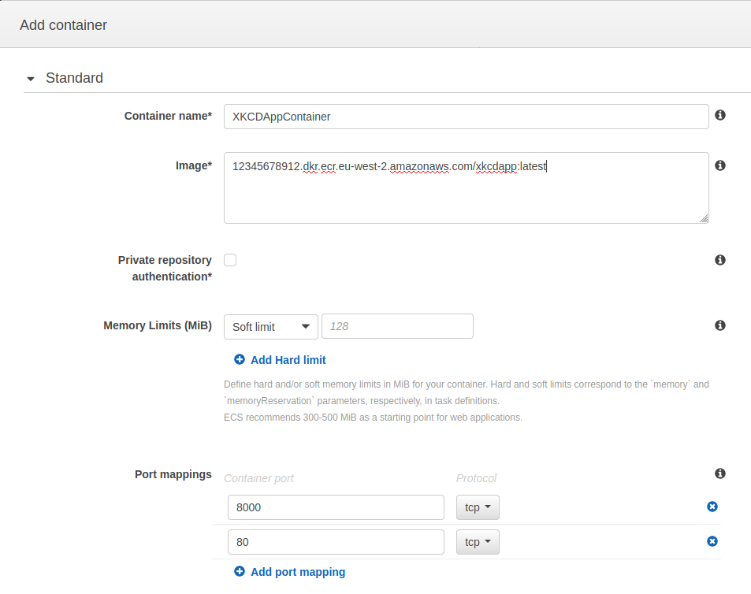

Remember to append `:latest` tag to your Elastic Container Registry URI.
| Setting | Option |
| -- | -- |
| Container name | XKCDAppContainer |
|  Image | 12345678912.dkr.ecr.eu-west-2.amazonaws.com/xkcdapp:latest |
|  Port Mappings | 8000 TCP  |
|  Port Mappings | 80 TCP  |


#### 6.4 Creating Cluster Service
Click on the default cluster on `Clusters` page under `Elastic Container Service`.

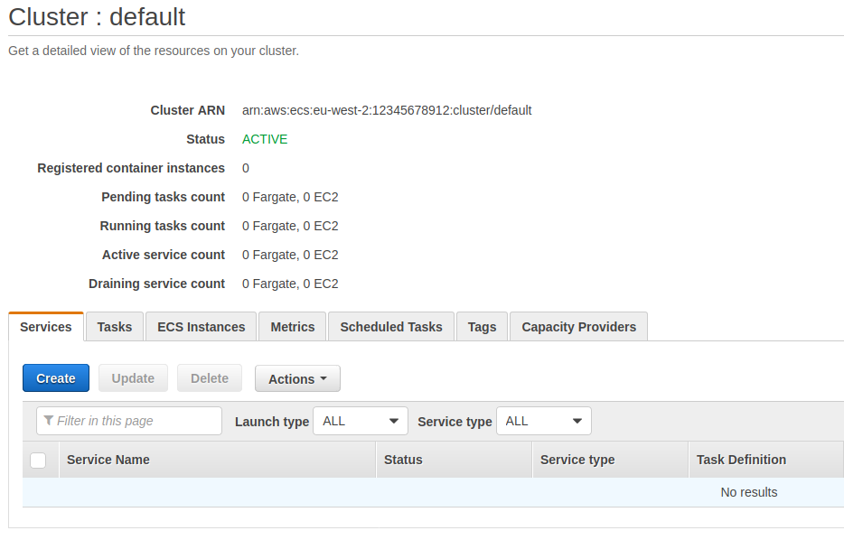

Click on `Create` button under `Services`.
##### 6.4.1 - Step 1: Configure Service 
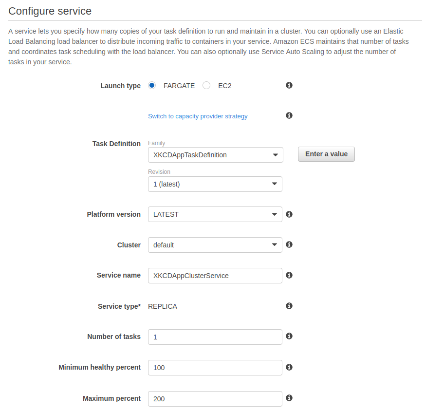
| Setting | Option |
| -- | -- |
| Launch Type | Fargate |
| Task Definition | XKCDAppTaskDefinition |
|  Task Revision| 1(latest) |
|  Platform Version |Latest  |
| Cluster| default |
| Service name | XKCDAppClusterService |
| Service Type | Replica  |
| Number of tasks  | 1 |
| Min healty percent |100 |
| Max percent |200 |

##### 6.4.2 - Step 2: Configure Network 

**VPC & Security Group**
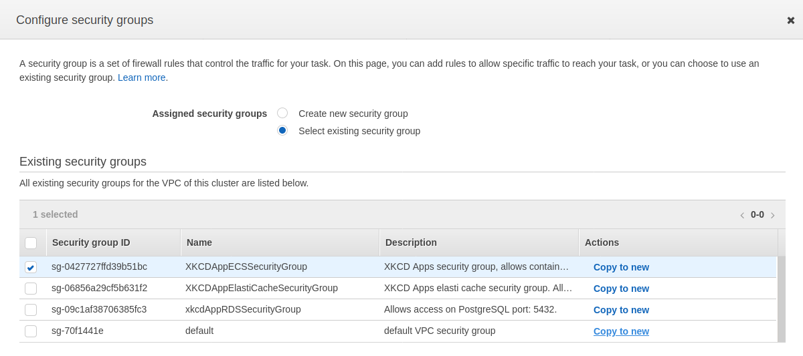
| Setting | Option |
| -- | -- |
| Cluster VPC | default |
| Subnets | 2a, 2b, 2c |
|  Security Group | Select existing:  XKCDAppECSSecurityGroup|
|  Auto-assign public IP | ENABLED  |


**Load Balancing**
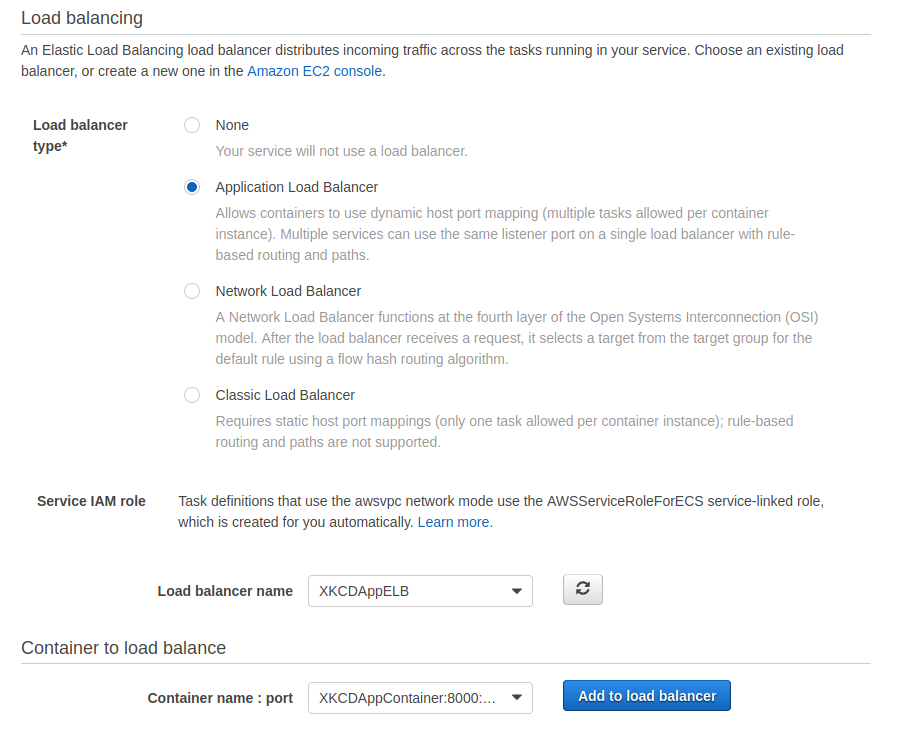

| Setting | Option |
| -- | -- |
| Load Balancer Type | Application Load Balancer |
| Load Balancer Name | XKCDAppELB |


**Container to load balance**
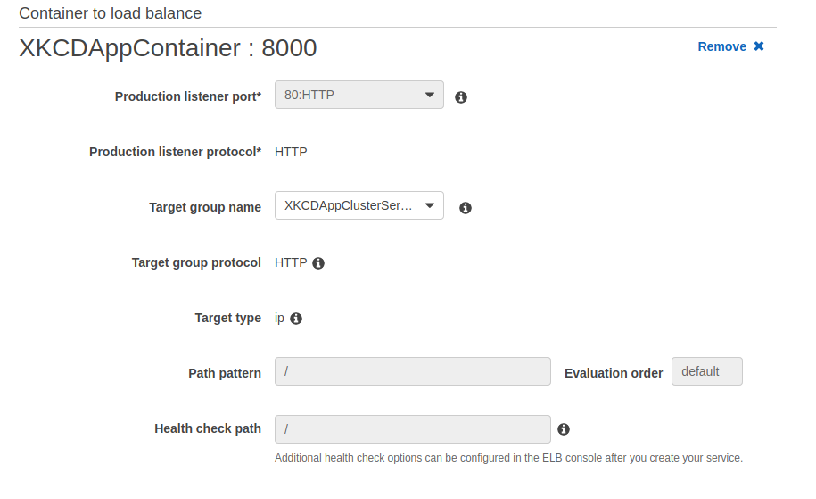

| Setting | Option |
| -- | -- |
| Production Listener Port| 80:HTTP |
| Production Listener Protocol | HTTP |
| Target group name | Select existing:  XKCDAppClusterServiceTargetGroup|
|Target group protocol | HTTP |
|Target type | IP |
| Path Pattern | /|
| Evaluation Order | default |
| Health check path| / |


##### 6.4.3 - Step 3: Set Auto Scaling
We will configure auto scaling later. Skip this step for now. 

##### 6.4.4 - Step 4: Review
Make sure your changes are correct and click on `Create Service` button.

Go to `Tasks` tab under `Service: XKCDAppClusterService`, and wait for your task's status to be `RUNNING`.

Now you can go to your Elastic Load Balancer's DNS name which is something like this: http://xkcdappelb-12346578.eu-west-2.elb.amazonaws.com:8000/

If you haven't done the ELB port forwarding remember to append the port `:8000` to DNS name.


#### 6.5 Load Testing our App with Hey

[Hey](https://github.com/rakyll/hey) is an open-sourced load testing tool. We will be using it to test how well a single container of XKCD App does under load. And with the information we get out of load-testing, we can decide on a good Auto Scaling Policy.

Let's run hey with 100 requests, 1 concurrent request at a time.

```bash
❯ hey -n 100 -c 1 http://xkcdappelb-123456789.eu-west-2.elb.amazonaws.com:8000/

Summary:
  Total:	64.8392 secs
  Slowest:	1.6920 secs
  Fastest:	0.1304 secs
  Average:	0.6484 secs
  Requests/sec:	1.5423
  
  Total data:	109851 bytes
  Size/request:	1098 bytes

Response time histogram:
  0.130 [1]	|■
  0.287 [6]	|■■■■■■
  0.443 [22]	|■■■■■■■■■■■■■■■■■■■■
  0.599 [7]	|■■■■■■■
  0.755 [43]	|■■■■■■■■■■■■■■■■■■■■■■■■■■■■■■■■■■■■■■■■
  0.911 [1]	|■
  1.067 [16]	|■■■■■■■■■■■■■■■
  1.224 [2]	|■■
  1.380 [0]	|
  1.536 [1]	|■
  1.692 [1]	|■


Latency distribution:
  10% in 0.3377 secs
  25% in 0.3638 secs
  50% in 0.6604 secs
  75% in 0.7351 secs
  90% in 1.0325 secs
  95% in 1.0596 secs
  99% in 1.6920 secs

Details (average, fastest, slowest):
  DNS+dialup:	0.0065 secs, 0.1304 secs, 1.6920 secs
  DNS-lookup:	0.0058 secs, 0.0000 secs, 0.5765 secs
  req write:	0.0000 secs, 0.0000 secs, 0.0001 secs
  resp wait:	0.6418 secs, 0.1302 secs, 1.5321 secs
  resp read:	0.0001 secs, 0.0000 secs, 0.0003 secs

Status code distribution:
  [200]	100 responses
```

In almost a minute, our application responded to 100 requests and it responded in average of 0.64 second. You can try to experiment with hey, change the request count, update your Task Definition's RAM or vCPU etc.

That's the ideal situation for XKCD App, so we will configure Auto Scaling condition to be 100 requests per minute per instance.

#### 6.6 Creating auto scaling for XKCDAppClusterService
Go to `XKCDAppClusterService` under default cluster and click update.
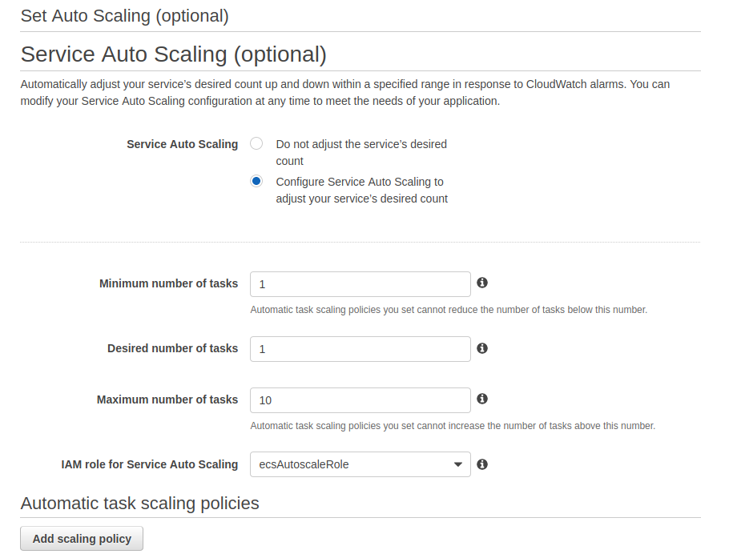

Set up a reasonable Auto Scaling Policy.
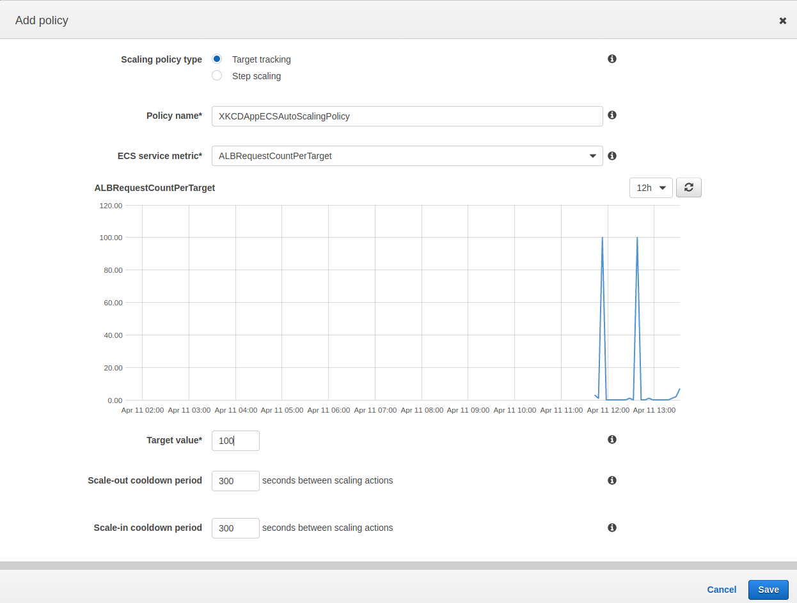

##### 6.6.1 Testing the Auto Scaling Policy
Normally, XKCDAppClusterService's desired count of instances is 1.
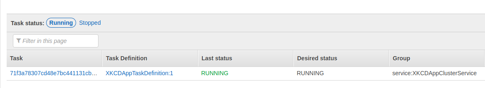

But when I load-test it again with hey,

```bash
❯ hey -n 400 -c 10 http://xkcdappelb-123456798.eu-west-2.elb.amazonaws.com:8000/
```
I could see that my instance count is increased after cool-down time.
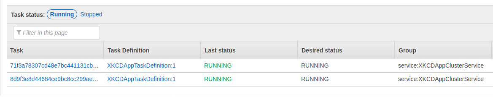


### 7. Updating security groups
Our XKCD App runs on the security group configuration of below diagram.
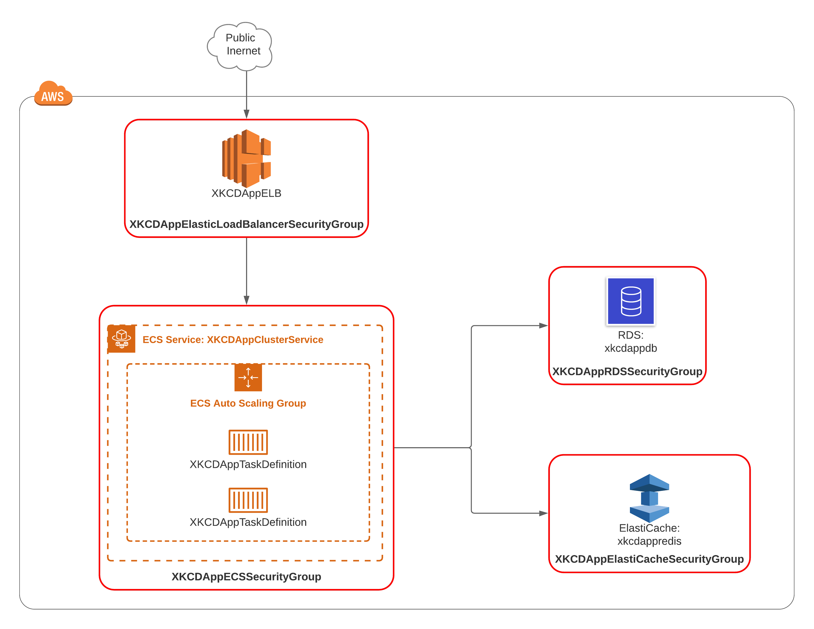

If we follow the access through the security groups, we can come up with a inbound/outbound access table:

| inbound | outbound |
| -- | -- | 
| Public Internet | XKCDAppElasticLoadBalancerSecurityGroup| 
| XKCDAppElasticLoadBalancerSecurityGroup | XKCDAppECSSecurityGroup | 
| XKCDAppECSSecurityGroup | XKCDAppElastiCacheSecurityGroup | 
| XKCDAppECSSecurityGroup | XKCDAppRDSSecurityGroup| 

Let's update our security groups. Go to `Security Groups` under `VPC`.

#### 7.1 XKCDAppElasticLoadBalancerSecurityGroup

Select `XKCDAppElasticLoadBalancerSecurityGroup` and edit the rules.

| Rule Type | Type | Destination Type | Destination |
|-- |-- |-- | -- |
| Inbound | HTTP:80| Anywhere |  | 
| Inbound | Custom TCP: 8000 |Custom | Anywhere | 
| Outbound | All Traffic  | Custom | XKCDAppECSSecurityGroup | 

#### 7.2 XKCDAppECSSecurityGroup

Select `XKCDAppECSSecurityGroup` and edit the rules.

| Rule Type | Type | Destination Type | Destination |
|-- |-- |-- | -- |
| Inbound | HTTP:80| Custom | XKCDAppElasticLoadBalancerSecurityGroup | 
| Inbound | Custom TCP: 8000 |Custom | XKCDAppElasticLoadBalancerSecurityGroup | 
| Outbound | All Traffic  | Anywhere |   | 
| Outbound | Custom TCP: 6379  | Custom | XKCDAppElastiCacheSecurityGroup | 
| Outbound | Custom TCP: 5432  | Custom | XKCDAppRDSSecurityGroup | 

#### 7.3 XKCDAppElastiCacheSecurityGroup

Select `XKCDAppElastiCacheSecurityGroup` and edit the rules.

| Rule Type | Type | Destination Type | Destination |
|-- |-- |-- | -- |
| Inbound | TCP: 6379| Custom | XKCDAppECSSecurityGroup | 


#### 7.4 XKCDAppRDSSecurityGroup

Select `XKCDAppRDSSecurityGroup` and edit the rules.

| Rule Type | Type | Destination Type | Destination |
|-- |-- |-- | -- |
| Inbound | TCP: 5432| Custom | XKCDAppECSSecurityGroup | 
