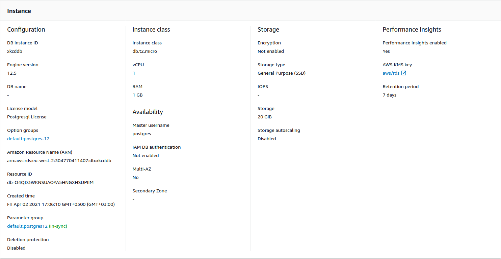

# xkcdApp


## Overview

we are going to use [xkcd library](https://pypi.org/project/xkcd/#description)

Writing XKCD Django App
0. creating virtualenvironment
1. installing django
2. creating & migrating our models 
3. adding homepage view
4. configuring urls
5. writing the HTML
6. Dockerizing our application
7. serving django with gunicorn on docker
AWS
1. creating parameter store
2. RDS security group & RDS Creation
3. Moving our app secrets to Parameter Store
4. uploading our docker image to ECR
5. deploying to ECS Fargate + hey benchmark
6. creating an ELB (ECS will only accept requests from ELB's security group.)
7. enabling HTTPS with ACM
8. Route53 configuration

## Implementing XKCD App

### Creating and activating virtual environment
```bash
# install the virtualenv package
pip install virtualenv

#create a virtualenv with the name venv
virtualenv venv

# activate virtualenv on windows
cd venv/Scripts
activate

# activate virtualenv on linux
./venv/bin/activate
```

### Installing Django

```bash
# install django and xkcd python library
pip install django xkcd

# create a django project name xkcd_app
django-admin startproject xkcd_app

# you should get the following files created
xkcd_app
├── manage.py
└── xkcd_app
    ├── asgi.py
    ├── __init__.py
    ├── settings.py
    ├── urls.py
    └── wsgi.py
```


Let's review and change the `xkcd_app/settings.py`

```python
# /xkcd_app/xkcd_app/settings.py

# allow any host for now
ALLOWED_HOSTS = ['*']

# add our app to installed apps
INSTALLED_APPS = [
    .
    .
    'django.contrib.staticfiles',
    'xkcd_app'
]
```

#### creating database models
Let's create our models. First we have to create a file named `models.py` on our `xkcd_app` folder.

```python
# /xkcd_app/xkcd_app/models.py
from django.db import models

class XKCDComicViews(models.Model):
    comic_number = models.IntegerField(primary_key=True, unique=True)
    view_count = models.IntegerField(default=0)
```

Let's migrate `XKCDComicViews` model to our database. Django will use sqlite3 by default for local development. 
```bash
# first apply default migrations
python manage.py migrate

# create our django apps migrations
python manage.py makemigrations xkcd_app

# and migrate them
python manage.py migrate xkcd_app
```


#### creating homepage view
Let's create `views.py` under our xkcd_app.

```python
# /xkcd_app/xkcd_app/views.py
from django.shortcuts import render
from .models import XKCDComicViews
import xkcd

def get_comic_and_increase_view_count(comic_number, increase_by=1):
    # get or create this with given comic_number
    comic, _ = XKCDComicViews.objects.get_or_create(pk=comic_number)
    comic.view_count += increase_by # increase the view_count
    comic.save() # save it

def homepage(request):
    # get a random comic from xkcd lib.
    random_comic = xkcd.getRandomComic()
    # increase it's view count
    get_comic_and_increase_view_count(random_comic.number, increase_by=1)
    # create a context to render the html with.
    context = {
        "number": random_comic.number,
        "image_link": random_comic.getImageLink(),
        "title": random_comic.getTitle(),
        "alt_text": random_comic.getAltText()
    }
    # return rendered html.
    return render(request, 'xkcd_app/homepage.html', context)

```
#### adding homepage view to urls.py
```python
# /xkcd_app/xkcd_app/urls.py
from django.contrib import admin
from django.urls import path
from .views import homepage
urlpatterns = [
    path('admin/', admin.site.urls),
    path('', homepage, name='homepage')
]
```
#### creating homepage.html

```html
<!-- /xkcd_app/xkcd_app/templates/xkcd_app/homepage.html -->
<html>
<head>
<title>XKCD App</title>
<link rel="stylesheet" href="https://stackpath.bootstrapcdn.com/bootstrap/4.5.2/css/bootstrap.min.css" integrity="sha384-JcKb8q3iqJ61gNV9KGb8thSsNjpSL0n8PARn9HuZOnIxN0hoP+VmmDGMN5t9UJ0Z" crossorigin="anonymous">
</head>
<body>
  <div class="container">
    <div class="row" style="margin-top:15px">
        <div class="col-sm-8 mx-auto">
            <div class="col text-center">
                <h2 class="header" >#{{number}} | {{title}}</h2>
            <hr/>
            
            <hr/>
                <a class="btn btn-default" href="">Another One</a>
            </div>
        </div>
    </div>
<script src="https://stackpath.bootstrapcdn.com/bootstrap/4.5.2/js/bootstrap.min.js" integrity="sha384-B4gt1jrGC7Jh4AgTPSdUtOBvfO8shuf57BaghqFfPlYxofvL8/KUEfYiJOMMV+rV" crossorigin="anonymous"></script>
</body>
</html>
```

#### creating requirements.txt file

Freeze the python requirements and move the file to root directory of the project. 

```bash
# cd into the root directory of the project and then run the command below 

# be sure to activate the virtual env
pip freeze > requirements.txt
```
For this project the requirements.txt should look like this:
```txt
boto3
xkcd
django
psycopg2-binary
gunicorn
```

### Dockerizing our Django App

Create a `Dockerfile` on the root directory of the project.

```Dockerfile
# /Dockerfile
FROM python:3.8
# PYTHONUNBUFFERED variable is used for non-buffered stdout
ENV PYTHONUNBUFFERED=1

# changing our working directory to be /opt
WORKDIR /opt

# copying and installing python requirements
COPY requirements.txt requirements.txt
RUN pip install -r requirements.txt

# copying the entire django application
COPY xkcd_app/ .

# exposing our django port: 8000
EXPOSE 8000

# serving django with gunicorn on port 8000 (1 worker, timeout of 5 secs)
CMD ["gunicorn", "--bind", "0.0.0.0:8000", "--workers", "1", "--timeout", "5", "xkcd_app.wsgi"]
```

#### Accessing Containers Shell for Debugging Purposes

First we need the container ID.
```bash
❯ docker ps
CONTAINER ID   IMAGE         COMMAND                  CREATED          STATUS          PORTS                    NAMES
f99841abbe11   xkcd:latest   "gunicorn --bind 0.0…"   18 minutes ago   Up 18 minutes   0.0.0.0:8000->8000/tcp   affectionate_cray
```
Then we can execute `bash` on that container ID, which will give us a shell on the container. 
```bash
❯ docker exec -ti f99841abbe11  bash 
root@f99841abbe11:/opt# 
```

## AWS

### AWS RDS - Relational Database Service
#### configuring RDS Security Group
On AWS Console, go to `Security Groups` under the `VPC` service. Press Create Security Group button.


| Setting | Option |
|-- |-- |
| Name | xkcdAppRDSSecurityGroup |
| Description | Allows access on PostgreSQL port: 5432. |
| VPC | Select your VPC, or use the default one. |
| Inbound Rules | Type: `PostgreSQL`, Source: `Anywhere` |
| Outbound Rules | Type: `All Trafic`, Destination: `Anywhere` |


#### creating a Postgresql Database on RDS 
On AWS Console, go to `RDS` and start to create a new RDS instance. RDS creation settings below uses default VPC and Free-tier. Feel free to change the configuration according to your requirements.

|Setting  | Option | Detail |
| -- | -- | -- | 
| Creation Method | Standart create | |
| Engine Option | PostgreSQL | |
| Engine Version | 12.5-R1 | Specify your DB engine version. |
| Templates | Free Tier | If you are building for prod or test envs, choose respectively.|
| DB Instance Identifier | xkcddb | |
| Master Username | postgres | |
| Master Password | < redacted > | |
| DB Instance Class | db.t2.micro | you can upgrade the instance class to your needs. |
| Storage Type| General Purpose(SSD) | |
| Allocated Storage | 20GB | |
| Enable Storage Autoscaling | False | You can enable this if you need it. |
| Multi-AZ Deployment | False | This feature not included in the free-tier. Production environments would benefit from this feature. |
| VPC | Default VPC | Ideally you should create your own VPC and choose that. |
| Subnet Group | default | |
| Public Access | No | If you are testing things, you can enable this feature and experiment. Not recommended for production apps.|
| VPC Security Group |Delete default and choose existing: `xkcdAppRDSSecurityGroup` | |
| Availability Zone | eu-west-2a | Choose one AZ if you are on free-tier.|
| Database Authentication | Password Authentication | |

##### acquiring the database connection credentials
Wait for the database creation to be complete. Go to `xkcddb` on `RDS > Databases` and then go to `Configuration` tab. 



#### updating django settings to use the PostgreSQL Database Backend

##### install the PostgreSQL library
```bash
# be sure to activate the venv environment
pip install psycopg2-binary
```
##### update the settings.py
```python
#/xkcd_app/xkcd_app/settings.py
import os
########
DATABASES = {
    'default': {
        'ENGINE': 'django.db.backends.postgresql',
        'NAME': os.environ.get('DATABASE_NAME'),
        'USER': os.environ.get('DATABASE_USER'),
        'PASSWORD': os.environ.get('DATABASE_PASSWORD'),
        'HOST': os.environ.get('DATABASE_HOST'),
        'PORT': '5432'
    }
}

```

Using environment variables for application configuration is not a secure way of doing things. Integrating AWS Parameter Store to our `settings.py` file is something easy. Let's configure AWS Systems Manager Parameter Store for XKCD App.

### Parameter Store

Go to `Parameter Store` under `AWS Systems Manager` and click on **Create Parameter**.

Parameter Store lets you create categorized paramater names, so you can have different parameters for different apps or app environments.
#### adding our secrets to parameter store
For **DATABASE_NAME** parameter, you can create a parameter as following:


| Setting | Option | Detail |
| --| --| --|
| Name | xkcdapp/test/DATABASE_NAME | app and environment categorized parameter name |
| Description | xkcd app RDS test DB identifier | |
| Tier | Standard | |
| Type | SecureString | This type of parameters are going to be encrypted while sitting. |
| KMS key source | My Current Account |  |
| KMS Key ID | alias/aws/ssm | Choose the default AWS managed key. This will allow ECS containers to access to parameters without further configuration. |
| Value | xkcddb  | |

Follow the same steps to add the remaining database connection credentials to paramater store. You may also want to add `SECRET_KEY` variable generated for your django project. Django's `SECRET_KEY` is used for encryption inside Django. 

When you are finished with adding the secrets, you should see something like this on Parameter Store Console.


#### configuring settings.py to use AWS Parameter Store


```python
# xkcd_app/xkcd_app/settings.py
import boto3
ssm = boto3.client('ssm', region_name='eu-west-2')

prefix = 'xkcdapp'
env = 'test'
prefixenv = f"/{prefix}/{env}/"

SECRET_KEY = ssm.get_parameter(Name=prefixenv + "DJANGO_SECRET_KEY")['Parameter']['Value']

DATABASES = {
    'default': {
        'ENGINE': 'django.db.backends.postgresql',
        'NAME': ssm.get_parameter(Name=prefixenv + "DATABASE_NAME")['Parameter']['Value'],
        'USER': ssm.get_parameter(Name=prefixenv + "DATABASE_USER")['Parameter']['Value'],
        'PASSWORD': ssm.get_parameter(Name=prefixenv + "DATABASE_PASSWORD")['Parameter']['Value'],
        'HOST': ssm.get_parameter(Name=prefixenv + "DATABASE_HOST")['Parameter']['Value'],
        'PORT': '5432'
    }
}

```

##### install AWS SDK for Python: boto3
```bash
pip install boto3
```

#### creating parameter store IAM Role
Go to `Roles` under `AWS IAM` and  click on **Create Role**.

Select the _System Manager_ use case.


Click on _Next: Permissions_ and then `Create Policy`.


Copy and paste the following AWS IAM Policy to editor and hit next.

```json
{
    "Version": "2012-10-17",
    "Statement": [
        {
            "Sid": "AllowSSMAccess",
            "Effect": "Allow",
            "Action": [
                "ssm:PutParameter",
                "ssm:DeleteParameter",
                "ssm:GetParameterHistory",
                "ssm:GetParametersByPath",
                "ssm:GetParameters",
                "ssm:GetParameter",
                "ssm:DescribeParameters",
                "ssm:DeleteParameters"
            ],
            "Resource": "arn:aws:ssm:*:*:parameter/*"
        }
    ]
}
```

Give a name and description to Parameter Store access role.


|Setting  |Option | 
| -- | -- | 
| Name | SystemsManagerParameterStoreFullAccess | 
| Description | Systems Manager Parameter Store Full Access Role. | 

We will be attaching this IAM Role to ECS containers we are going to run. So they can read the parameters.
#### migrating django models to RDS

### ElastiCache Redis
#### creating security group, IAM Role
#### adding endpoint to parameterstore
#### django dependency + settings file
### Elastic Container Registry
#### uploading docker image to ECR

### Elastic Container Service
#### ExecutionRole, Security Group
#### creating fargate flee

### Elastic Load Balancing
#### Security Group
#### creation

### Route53

--------
- parameter store + parameterstore Role (seanjziegler)
- database to aws rds, sec group open
- session on redis
- 


- dockerize - upload to ecr 
- ecs - hey benchmark - autoscaling group
- elb
- acm certificate
